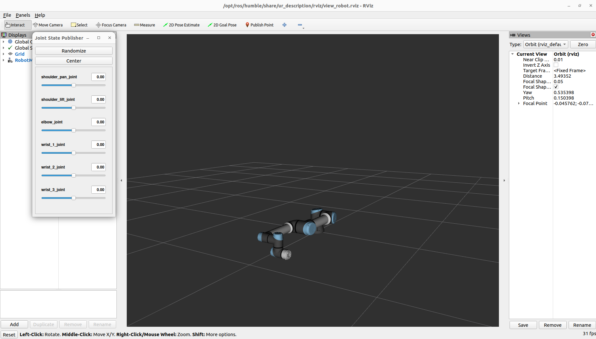
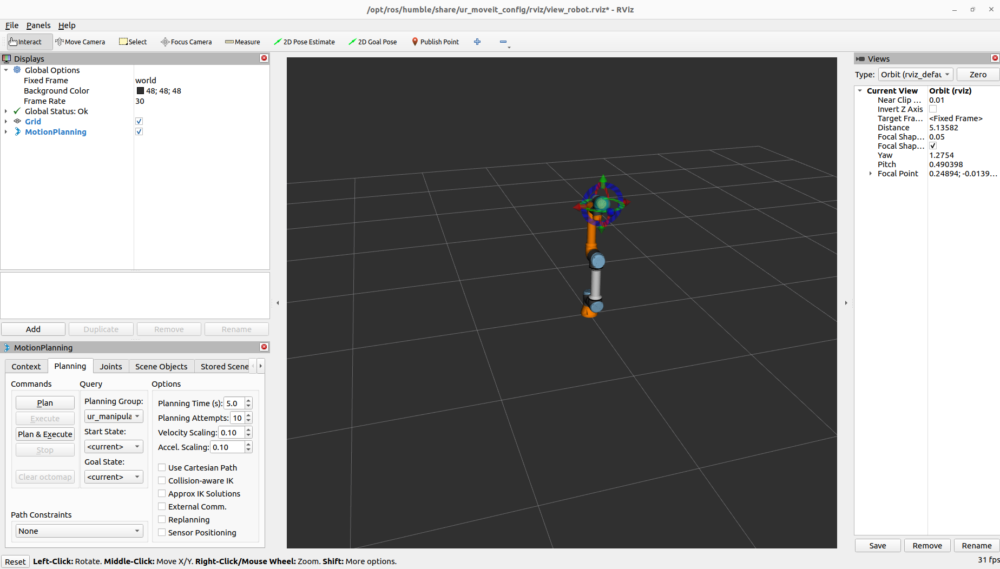
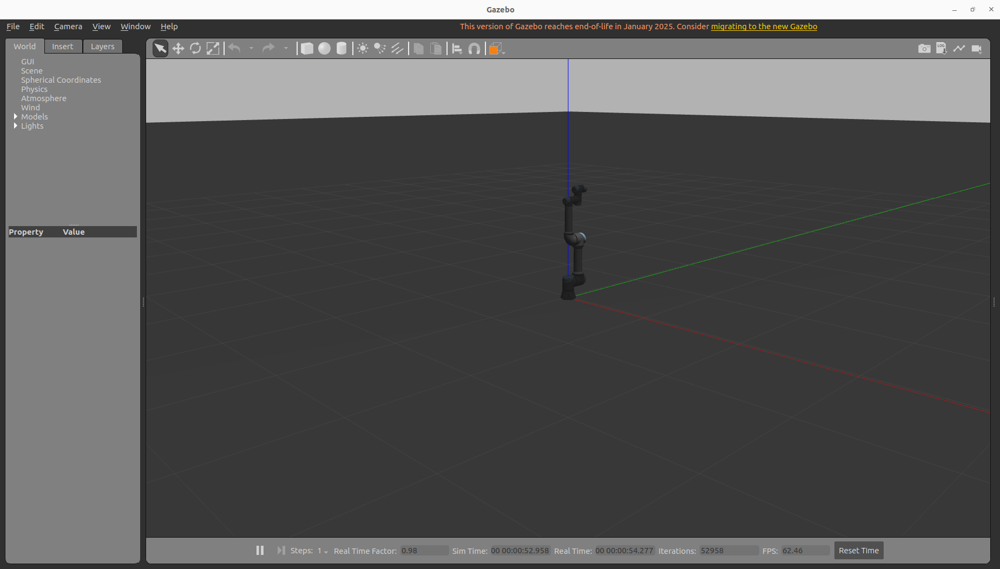

# UR5e + ROS 2 + MoveIt 2 教程

# 项目简介
本教程记录了在 Ubuntu 22.04、ROS 2 Humble 环境下，从零搭建 UR5e 机械臂开发环境的完整过程。

# I. 从零开始搭建UR5e仿真环境

## 1. 环境准备
### 1.1 环境版本

本文使用：
Ubuntu 22.04 LTS  
ROS 2 Humble  
MoveIt 2  
Gazebo Classic 11  
RViz 2  
Universal Robots ROS 2 Driver  
UR5e  
如果你不知道这些是什么，请问AI  

#### 如果你已经安装好了，请跳转至 `2.创建UR5e工作空间`

ROS 2 Humble 官方支持 Ubuntu 22.04。安装前应先完整更新系统，避免 systemd、udev 等依赖版本冲突。

#### 为什么选择 ROS 2 Humble？ 
截止2026年6月，ROS 2 Humble 是LTS(长期支持)版本，适合搭配 Ubuntu 22.04 使用，因此推荐使用Humble

#### 为什么使用原生 Ubuntu？ 

本项目推荐直接在电脑上安装 Ubuntu 22.04，不建议把虚拟机作为 UR5e 真机开发的主要环境。  
原因是：

UR5e 网络通信更稳定  
Gazebo 和 RViz 性能更好  
USB、相机和传感器兼容性更高  
ROS 2 的 DDS 网络配置更简单  
更接近实验室和工业开发环境  

虚拟机适合学习 ROS 2 基础。涉及 Gazebo、MoveIt 和真机控制时，原生 Ubuntu 更稳妥。  

---
### 1.2 更新系统
从一个干净的 Ubuntu 22.04 开始，打开终端：
```bash
sudo apt update
sudo apt install software-properties-common curl git wget -y
```
启用 Ubuntu Universe 软件源：
```bash
sudo add-apt-repository universe
sudo apt update
```

---
### 1.3 安装 ROS 2 Humble
把 ROS 2 的官方软件源加入 Ubuntu：
```bash
sudo apt install curl -y

sudo curl -sSL \
  https://raw.githubusercontent.com/ros/rosdistro/master/ros.key \
  -o /usr/share/keyrings/ros-archive-keyring.gpg
```
```bash
echo "deb [arch=$(dpkg --print-architecture) signed-by=/usr/share/keyrings/ros-archive-keyring.gpg] \
http://packages.ros.org/ros2/ubuntu \
$(. /etc/os-release && echo $UBUNTU_CODENAME) main" \
| sudo tee /etc/apt/sources.list.d/ros2.list > /dev/null
```
安装 ROS 2 Desktop：
```bash
sudo apt update
sudo apt install ros-humble-desktop ros-dev-tools -y
```
加载 ROS 2 环境：
```bash
source /opt/ros/humble/setup.bash
```
写入 `~/.bashrc`：
```bash
echo "source /opt/ros/humble/setup.bash" >> ~/.bashrc
source ~/.bashrc
```
验证：
```bash
ros2 --help
```
### Miniconda 会修改 PATH 等环境变量，使 ROS 2 误用 Conda 中的 Python 和依赖。使用 ROS 2 前建议退出 Conda，并关闭 base 环境自动激活。

基础环境验证：
```bash
printenv ROS_DISTRO
which ros2
python3 --version
```

预期：
```bashhumble
/usr/bin/ros2
Python 3.10.x
```
这能够较早发现 Conda 和 PATH 污染。

---
### 1.4 安装开发工具
```bash
sudo apt install \
  python3-colcon-common-extensions \
  python3-rosdep \
  python3-vcstool \
  python3-pip \
  build-essential \
  cmake \
  git \
  -y
```
初始化 `rosdep`：
```bash
sudo rosdep init
rosdep update
```
如果出现：
```bash
ERROR: default sources list file already exists
```
说明已经初始化过，直接执行：
```bash
rosdep update
```

---
### 1.5 安装 MoveIt 2
#### 本项目使用 MoveIt 2 二进制包，以减少安装和编译难度。只有需要修改 MoveIt 源码或使用未发布功能时，才建议从源码编译。
使用二进制包安装：
```bash
sudo apt update
sudo apt install ros-humble-moveit -y
```
安装常用插件：
```bash
sudo apt install \
  ros-humble-moveit-visual-tools \
  ros-humble-moveit-setup-assistant \
  ros-humble-trac-ik-kinematics-plugin \
  -y
```
检查安装：
```bash
ros2 pkg list | grep moveit
```

#### MoveIt 2 负责运动规划、逆运动学、碰撞检测和轨迹生成。

---
## 2. 创建 UR5e 工作空间

创建工作空间（workspace）：
```bash
mkdir -p ~/ur5e_ws/src
cd ~/ur5e_ws
```

---
## 3. 安装 UR 官方 ROS 2 软件包
### 3.1 推荐方式：APT 安装
```bash
sudo apt update
sudo apt install ros-humble-ur -y
```
这通常会安装：
```bash
ur_description
ur_robot_driver
ur_controllers
ur_moveit_config
ur_dashboard_msgs
ur_client_library
```
检查：
```bash
ros2 pkg list | grep "^ur"
```
查看软件包位置：
```bash
ros2 pkg prefix ur_robot_driver
ros2 pkg prefix ur_description
ros2 pkg prefix ur_moveit_config
```
与 MoveIt2 类似的是，对于不需要修改驱动源码的用户，优先使用 APT 二进制包可以减少依赖和编译问题。

---
### 3.2 查看 UR5e 模型
只加载 URDF 模型：
```bash
ros2 launch ur_description view_ur.launch.py ur_type:=ur5e
```
成功后，RViz 中应显示 UR5e。
此时，Joint State Publisher 也应一并启动，拖动滑块就能看到各个关节的运动情况


这个步骤只验证：
```bash
URDF/Xacro
mesh 模型
TF 关系
关节定义
robot_state_publisher
```
它还没有启动 MoveIt，也没有启动 Gazebo。

`ur_description` 软件包提供 UR 系列机械臂的运动学和视觉模型。

---
## 4. 首先运行 Fake Hardware 仿真

Fake Hardware 不计算真实物理，只模拟关节状态和控制器响应，适合验证 MoveIt 的规划和轨迹执行。

### 终端 1：启动假硬件和控制器

```bash
source /opt/ros/humble/setup.bash

ros2 launch ur_robot_driver ur_control.launch.py \
  ur_type:=ur5e \
  robot_ip:=xxx.xxx.xxx.xxx \
  use_fake_hardware:=true \
  fake_sensor_commands:=true \
  launch_rviz:=false
```

Fake Hardware 模式下不会连接该 IP，这里仅作为必要参数，因此可以填写任意合法 IPv4 地址。

### 终端 2：启动 MoveIt 和 RViz

```bash
source /opt/ros/humble/setup.bash

ros2 launch ur_moveit_config ur_moveit.launch.py \
  ur_type:=ur5e \
  launch_rviz:=true
```

查看 launch 参数：

```bash
ros2 launch ur_moveit_config ur_moveit.launch.py --show-args
```

### 检查节点，开启第三个终端

```bash
ros2 node list
```

正常情况下应看到：

```text
/move_group
/robot_state_publisher
/controller_manager
/rviz2_moveit
```

### 检查控制器

```bash
ros2 control list_controllers
```

至少应看到：

```text
joint_state_broadcaster                    active
scaled_joint_trajectory_controller         active
```

### 检查关节状态

```bash
ros2 topic echo /joint_states --once
```

后续可以编写统一 launch 文件，一次启动 Fake Hardware、控制器、MoveIt 和 RViz。

### 测试 Plan 和 Execute



在 RViz 的 `MotionPlanning` 面板中：

1. 将 `Planning Group` 设为：

```text
ur_manipulator
```

2. 拖动机械臂末端的交互标记到可达位置，或者在Joints面板中设置关节角。

3. 点击：

```text
Plan
```

如果规划成功，RViz 中会显示一条预览轨迹。

4. 点击：

```text
Execute
```

机械臂模型应按照规划轨迹运动。

也可以直接点击：

```text
Plan & Execute
```

如果 `Plan` 成功但 `Execute` 失败，优先检查：

```bash
ros2 topic echo /joint_states --once
ros2 control list_controllers
```

应确认 `/joint_states` 正常发布，并且轨迹控制器处于 `active` 状态。

---
## 5. 安装 Gazebo Classic 仿真

对于 ROS 2 Humble，可以使用 UR 官方的 Gazebo Classic 仿真仓库。该仓库主要针对 Humble，官方页面已经说明 Gazebo Classic 方案不再面向后续 ROS 2 版本维护。

进入源码目录：
```bash
cd ~/ur5e_ws/src
```

克隆 Humble 分支：
```bash
git clone -b humble \
  https://github.com/UniversalRobots/Universal_Robots_ROS2_Gazebo_Simulation.git
```

安装 Gazebo 和 ROS 接口：
```bash
sudo apt install \
  gazebo \
  ros-humble-gazebo-ros-pkgs \
  ros-humble-gazebo-ros2-control \
  ros-humble-ros2-control \
  ros-humble-ros2-controllers \
  -y
```

---
## 6. 安装工作空间依赖

回到工作空间：
``` bash
cd ~/ur5e_ws
```

安装依赖：
```bash
rosdep install \
  --from-paths src \
  --ignore-src \
  -r \
  -y \
  --rosdistro humble
```
如果某个依赖已经安装，rosdep 会自动跳过

---
## 7. 编译工作空间

```bash
cd ~/ur5e_ws
colcon build --symlink-install
```

编译成功后：
```bash
source ~/ur5e_ws/install/setup.bash
```

**可选:** 写入 `~/.bashrc`：
```bash
echo "source ~/ur5e_ws/install/setup.bash" >> ~/.bashrc
source ~/.bashrc
```
如果以后切换工作空间，切记在 `~/.bashrc` 中注释掉这条  
如果不写入，以后每次新开终端并且使用这个工作空间时，都必须source

检查 Gazebo 仿真包：
```bash
ros2 pkg list | grep ur_simulation_gazebo
```

查看路径：
```bash
ros2 pkg prefix ur_simulation_gazebo
```

---
## 8. 启动 UR5e Gazebo 与 MoveIt 联动仿真

UR 官方 Gazebo 仓库已经提供统一启动文件，可同时启动 Gazebo、`ros2_control`、MoveIt 和 RViz。

先查看该 launch 文件支持的参数：

```bash
source /opt/ros/humble/setup.bash
source ~/ur5e_ws/install/setup.bash

ros2 launch ur_simulation_gazebo ur_sim_moveit.launch.py --show-args
```

确认参数中包含：
```text
ur_type
launch_rviz
```

随后启动 UR5e 联动仿真：
```bash
ros2 launch ur_simulation_gazebo ur_sim_moveit.launch.py ur_type:=ur5e launch_rviz:=true
```

该 launch 会启动：

* Gazebo
* UR5e 模型
* `gazebo_ros2_control`
* 关节控制器
* `/joint_states`
* MoveIt `move_group`
* MoveIt 专用 RViz



启动后，在 RViz 的 `MotionPlanning` 面板中选择：

```text
Planning Group: ur_manipulator
```

拖动末端交互标记，然后依次点击：

```text
Plan
Execute
```

机械臂应在 Gazebo 和 RViz 中同步运动。

检查节点：

```bash
ros2 node list
```

检查控制器：

```bash
ros2 control list_controllers
```

检查关节状态：

```bash
ros2 topic echo /joint_states --once
```

---
## 9. 常见问题与排查

该章节的问题仅作为参考，都是本人在开发中遇到的问题以及一些潜在问题。

### 9.1 Conda 导致 Python 或动态库冲突

Conda 可能修改 `PATH`、Python 和动态库路径，导致 ROS 2 使用错误的依赖。

常见现象：

```text
ModuleNotFoundError
symbol lookup error
libtinfo.so.6: no version information available
```

检查：

```bash
which python3
which ros2
echo $CONDA_PREFIX
```

正常应为：

```text
/usr/bin/python3
/usr/bin/ros2
```

如果终端前有 `(base)`，先退出 Conda：

```bash
conda deactivate
```

关闭自动进入 base：

```bash
conda config --set auto_activate_base false
```

重新打开终端后加载 ROS 2：

```bash
source /opt/ros/humble/setup.bash
source ~/ur5e_ws/install/setup.bash
```

进行 ROS 2 开发时，尽量不要在 Conda 环境中编译或运行工作空间。

---
### 9.2 工作空间没有 source

新终端没有加载工作空间时，ROS 2 无法找到其中的软件包和 launch 文件。

常见报错：

```text
Package 'xxx' not found
No executable found
launch file was not found
```

手动加载：

```bash
source /opt/ros/humble/setup.bash
source ~/ur5e_ws/install/setup.bash
```

检查：

```bash
ros2 pkg prefix ur_simulation_gazebo
```

如果提示 `Package not found`，确认工作空间已经编译：

```bash
cd ~/ur5e_ws
colcon build --symlink-install
source install/setup.bash
```

首次编译成功后，可以写入 `~/.bashrc`：

```bash
echo "source ~/ur5e_ws/install/setup.bash" >> ~/.bashrc
```

---
### 9.3 控制器没有 active

如果 `Execute` 失败，先检查控制器状态：

```bash
ros2 control list_controllers
```

正常应看到：

```text
joint_state_broadcaster                    active
scaled_joint_trajectory_controller         active
```

如果控制器显示为 `inactive`，可以手动启动：

```bash
ros2 control set_controller_state joint_state_broadcaster active
ros2 control set_controller_state scaled_joint_trajectory_controller active
```

如果找不到控制器，检查 `controller_manager` 是否正常启动，并重新启动仿真或驱动。

---
### 9.4 Plan 成功但 Execute 失败

如果轨迹能够规划，但执行失败，先检查控制器和关节状态：

```bash
ros2 control list_controllers
ros2 topic echo /joint_states --once
```

确认轨迹控制器处于 `active`，并且 `/joint_states` 正常发布。

还应确认 MoveIt 使用的控制器名称与实际控制器一致。若仍然失败，重新启动驱动、MoveIt 或 Gazebo 后再测试。

---
### 9.5 RViz 与 Gazebo 模型不同步

先检查关节状态是否正常发布：

```bash
ros2 topic echo /joint_states --once
```

再确认 RViz 的 `Fixed Frame` 设置正确，通常为：

```text
base_link
```

如果 Gazebo 中机械臂运动，但 RViz 不更新，检查 `robot_state_publisher`、控制器和 `/joint_states` 是否正常。仍未恢复时，重新启动 Gazebo 与 MoveIt 联动 launch。

---
### 9.6 URDF 和 SRDF robot name 不一致

如果 URDF 与 SRDF 中的机器人名称不同，MoveIt 可能无法正确加载模型。

检查：

```bash
ros2 param get /robot_state_publisher robot_description
ros2 param get /move_group robot_description
ros2 param get /move_group robot_description_semantic
```

确认开头的名称一致，例如：

```xml
<robot name="ur">
```

如果名称不同，修改对应的 URDF、Xacro、SRDF 或 launch 配置，使其保持一致，然后重新编译并启动。

---
### 9.7 `kinematics.yaml` 未加载

如果运动学插件没有加载，可能出现：

```text
No kinematics plugins defined
```

检查 MoveIt 参数：

```bash
ros2 param get /move_group \
  robot_description_kinematics.ur_manipulator.kinematics_solver
```

正常应返回类似：

```text
kdl_kinematics_plugin/KDLKinematicsPlugin
```

如果参数为空，检查 launch 文件是否加载了：

```text
ur_moveit_config/config/kinematics.yaml
```

修改后重新启动 MoveIt。

---
### 9.8 末端目标不可达

如果末端目标超出机械臂工作空间，或姿态要求过于苛刻，规划可能失败。

可以尝试：

```text
将目标移近机械臂
减小姿态变化
避免机械臂接近完全伸直
更换一个初始关节姿态
```

也可以先在 RViz 中小幅拖动末端标记，确认目标是否可达。

---

# II. UR5e 真机运行流程

本章记录真实 UR5e 机械臂的启动流程。真机运行前必须先在 Gazebo 或 Fake Hardware 中跑通相同 demo，并确认现场没有人员、工具或线缆处在机械臂运动范围内。

真机和仿真的主要区别是：

```text
仿真：Gazebo 提供机器人、控制器和 joint_states
真机：UR ROS 2 Driver 连接真实控制柜，MoveIt 只负责规划和发送轨迹
```

## 1. 打通真机网络连接

确认 Ubuntu 主机和 UR5e 在同一个网段。例如：

```text
电脑：192.168.2.123/24
UR5e：192.168.2.100/24
```

检查网络连通：

```bash
ping 192.168.2.100
```

还需要确认以下通信链路正常：

```text
Dashboard
RTDE
Primary Client Interface
TCP 30001
```

如果能 ping 通但驱动无法启动，优先检查防火墙、网线、IP 网段、示教器网络设置和 URCap/External Control 配置。

---
## 2. 在 Ubuntu 远程操作真实 PolyScope

最初尝试过 Docker 版 URSim，但 URSim 是独立的虚拟机器人，不能同步真实机械臂位姿。真机调试时，应操作真实示教器上的 PolyScope。

如果真实示教器开启了 VNC，可以在 Ubuntu 中使用 Remmina 连接：

```text
192.168.2.100:5900
```

连接后，在 Ubuntu 中查看和操作真实 PolyScope，并将机器人切换到远程控制模式。启动 ROS 2 driver 前，应确认机器人处于可远程控制、可接收 External Control 程序的状态。

---
## 3. `urcl_ws` overlay 的作用

真机启动时曾持续出现：

```text
Could not get configuration package within timeout
Configured timeout: 1 sec
```

排查后确认：

```text
Dashboard 正常
RTDE 正常
TCP 30001 正常
真机能够发送 Primary Interface 数据
```

问题来自 `ur_client_library 2.11.0` 中获取 configuration package 的固定 `1s` 超时。为避免直接修改系统 APT 包，创建了独立 overlay workspace：

```text
~/urcl_ws
```

核心修改是把超时时间从：

```cpp
std::chrono::milliseconds timeout(1000);
```

改为：

```cpp
std::chrono::milliseconds timeout(10000);
```

然后重新编译 overlay，让 ROS 2 在运行时优先使用 `~/urcl_ws/install` 中的同名库。这个 workspace 主要服务于真机问题；只跑 Gazebo 仿真时通常不需要它。

---
## 4. 真机 source 顺序

真机运行时，终端环境必须按顺序加载：

```bash
source /opt/ros/humble/setup.bash
source ~/urcl_ws/install/setup.bash
source ~/ur5e_ws/install/setup.bash
```

顺序含义：

```text
/opt/ros/humble        ROS 2 和 APT 安装的基础包
~/urcl_ws/install      覆盖 ur_client_library 等真机驱动相关库
~/ur5e_ws/install      当前教程和 demo 包
```

确认当前使用的是 overlay 中的 `ur_client_library`：

```bash
ros2 pkg prefix ur_client_library
```

期望输出类似：

```text
/home/tinavi/urcl_ws/install/ur_client_library
```

如果输出仍然指向 `/opt/ros/humble`，说明 `urcl_ws` 没有 source，或者 source 顺序不对。

---
## 5. 启动真机驱动和 MoveIt

### 终端 1：启动 UR ROS 2 Driver

```bash
source /opt/ros/humble/setup.bash
source ~/urcl_ws/install/setup.bash
source ~/ur5e_ws/install/setup.bash

ros2 launch ur_robot_driver ur_control.launch.py \
  ur_type:=ur5e \
  robot_ip:=192.168.2.100 \
  headless_mode:=true \
  launch_rviz:=false
```

如果现场需要手动在示教器上启动 External Control 程序，可以将 `headless_mode` 设为 `false`，并按示教器提示操作。

### 终端 2：启动 MoveIt 和 RViz

```bash
source /opt/ros/humble/setup.bash
source ~/urcl_ws/install/setup.bash
source ~/ur5e_ws/install/setup.bash

ros2 launch ur_moveit_config ur_moveit.launch.py \
  ur_type:=ur5e \
  launch_rviz:=true
```

完成后，真机、ROS 2、MoveIt 和 RViz 应建立联动。

---
## 6. 真机状态检查

确认 `/joint_states` 只有一个发布者：

```bash
ros2 topic info /joint_states
```

正常情况下发布者应来自：

```text
joint_state_broadcaster
```

检查控制器：

```bash
ros2 control list_controllers
```

正常应看到：

```text
joint_state_broadcaster                    active
scaled_joint_trajectory_controller         active
```

读取一次关节状态：

```bash
ros2 topic echo /joint_states --once
```

如果 `/joint_states` 有多个发布者，常见原因是同时启动了 Gazebo、Fake Hardware 或其他 joint state publisher。真机运行时，不要同时启动仿真环境。

---
## 7. 运行真机 demo

真机 demo 建议从慢速、小范围动作开始。每次运行前，都确认 RViz 中当前机械臂位姿和真实机械臂一致。

### 笛卡尔路径循环

```bash
source /opt/ros/humble/setup.bash
source ~/urcl_ws/install/setup.bash
source ~/ur5e_ws/install/setup.bash

ros2 launch ur5e_cartesian_motion cartesian_draw_loop_real.launch.py \
  mode:=line
```

支持的模式：

```text
line
square
circle
```

### CSV 曲线路径

```bash
source /opt/ros/humble/setup.bash
source ~/urcl_ws/install/setup.bash
source ~/ur5e_ws/install/setup.bash

ros2 launch ur5e_curve_path curve_path_real.launch.py
```

真机执行 CSV 曲线前，建议先在仿真中运行：

```bash
ros2 launch ur5e_curve_path curve_path_sim.launch.py
```

确认路径范围、起始关节位姿、速度限制和末端姿态都合理后，再切到真机。

---
## 8. 真机 Cartesian Path 异常排查

曾遇到 `cartesian_path` 规划 fraction 很低，例如：

```text
Cartesian fraction 只有 0.008 或 0.009
```

同时可能出现：

```text
Semantic description is not specified for the same robot as the URDF
```

进一步检查发现：

```text
robot_state_publisher URDF: ur5e
move_group URDF: ur
move_group SRDF: ur
```

问题本质是 URDF 和 SRDF 的 robot name 不一致，或 demo 节点没有拿到和 `move_group` 一致的 `robot_description`、`robot_description_semantic`、`robot_description_kinematics`。

真机 launch 文件中应统一加载：

```text
robot_description
robot_description_semantic
robot_description_kinematics
```

修复后应满足：

```text
URDF 与 SRDF 匹配
getCurrentPose() 稳定正常
Cartesian Path 规划正常
真机运动与仿真逻辑一致
```

如果再次出现类似问题，优先检查：

```bash
ros2 param get /robot_state_publisher robot_description
ros2 param get /move_group robot_description
ros2 param get /move_group robot_description_semantic
ros2 param get /move_group robot_description_kinematics
```

---

# III. Gazebo 中的 UR5e 运动 Demo

本章开始使用当前 workspace 中的示例包，在 Gazebo 仿真环境里逐步验证 UR5e 的运动控制流程。

本章只讨论仿真，不包含真实机械臂连接、真实机器人 IP、示教器配置或现场安全流程。后续所有命令都默认运行在 Gazebo、MoveIt 和 RViz 已经正常启动的前提下。

当前 demo 包如下：

| 包名 | 作用 | 对应 README |
|---|---|---|
| `ur5e_motion_cpp` | 直接向关节轨迹 action 发送目标点 | `src/ur5e_motion_cpp/README.md` |
| `ur5e_basic_motion` | MoveIt 固定位姿规划和执行 | `src/ur5e_basic_motion/README.md` |
| `ur5e_obstacle_motion` | MoveIt Planning Scene 避障规划 | `src/ur5e_obstacle_motion/README.md` |
| `ur5e_cartesian_motion` | 直线、方形、圆形笛卡尔路径 | `src/ur5e_cartesian_motion/README.md` |
| `ur5e_curve_path` | 从 CSV 读取曲线路径并循环执行 | `src/ur5e_curve_path/README.md` |
| `Universal_Robots_ROS2_Gazebo_Simulation` | UR 官方 Gazebo Classic 仿真包 | `src/Universal_Robots_ROS2_Gazebo_Simulation/README.md` |

---
## 1. 启动统一仿真环境

每个 demo 运行前，都先启动 UR5e Gazebo 与 MoveIt 联动仿真：

```bash
source /opt/ros/humble/setup.bash
source ~/ur5e_ws/install/setup.bash

ros2 launch ur_simulation_gazebo ur_sim_moveit.launch.py \
  ur_type:=ur5e \
  launch_rviz:=true
```

这个 launch 会同时启动 Gazebo、UR5e 模型、`ros2_control`、控制器、`move_group` 和 RViz。

新开一个终端检查控制器：

```bash
source /opt/ros/humble/setup.bash
source ~/ur5e_ws/install/setup.bash

ros2 control list_controllers
```

正常情况下至少应看到：

```text
joint_state_broadcaster                    active
joint_trajectory_controller                active
```

再检查关节状态：

```bash
ros2 topic echo /joint_states --once
```

如果控制器和 `/joint_states` 都正常，再继续运行后面的 demo。

---
## 2. 编译当前 demo 包

如果已经在第 I 节完整编译过 workspace，可以跳过本节。修改 demo 代码或首次拉取本仓库后，建议重新编译：

```bash
cd ~/ur5e_ws
source /opt/ros/humble/setup.bash

colcon build --symlink-install --executor sequential --parallel-workers 1
source install/setup.bash
```

如果电脑内存较小，可以只编译正在使用的包，例如：

```bash
colcon build --packages-select ur5e_basic_motion \
  --executor sequential \
  --parallel-workers 1
source install/setup.bash
```

确认 ROS 2 能找到这些 demo：

```bash
ros2 pkg list | grep "ur5e_"
```

---
## 3. ROS 2 关节轨迹 Action 示例

包：

```text
ur5e_motion_cpp
```

这个示例不经过 MoveIt 规划，而是直接向控制器的 action server 发送一组关节目标：

```text
/joint_trajectory_controller/follow_joint_trajectory
```

它适合用来理解 ROS 2 action、`FollowJointTrajectory` 和控制器之间的关系。

运行：

```bash
source ~/ur5e_ws/install/setup.bash
ros2 run ur5e_motion_cpp move_joints
```

程序会等待 action server 可用，然后发送 6 个关节的目标角度，轨迹时间为 `4.0s`。

如果终端输出：

```text
Trajectory action server not available.
```

先确认仿真环境已经启动，并检查当前控制器 action 名称：

```bash
ros2 action list | grep follow_joint_trajectory
```

注意：该示例直接给控制器下发关节轨迹，不会自动避障，也不会判断末端目标是否合理。因此它适合做控制器接口验证，不适合作为复杂任务的主要规划方式。

---
## 4. MoveIt 固定位姿规划

包：

```text
ur5e_basic_motion
```

这是最小 MoveIt 示例。节点会创建 `MoveGroupInterface`，使用规划组：

```text
ur_manipulator
```

然后规划并执行到一个固定末端位姿。

运行：

```bash
source ~/ur5e_ws/install/setup.bash
ros2 launch ur5e_basic_motion basic_motion.launch.py
```

该 launch 使用 `use_sim_time=True`，适合当前 Gazebo 仿真环境。

如果运行成功，Gazebo 和 RViz 中的机械臂都会运动到目标附近。这个 demo 能跑通，说明以下链路基本正常：

```text
MoveIt -> move_group -> ros2_control -> Gazebo -> /joint_states -> RViz
```

如果规划失败，优先检查：

```bash
ros2 node list
ros2 control list_controllers
ros2 topic echo /joint_states --once
```

---
## 5. MoveIt 避障规划

包：

```text
ur5e_obstacle_motion
```

这个示例会向 MoveIt Planning Scene 中加入一个 box 障碍物，然后规划到固定目标位姿。它用来验证 MoveIt 是否正确接收碰撞物体，并在规划时避开障碍。

运行：

```bash
source ~/ur5e_ws/install/setup.bash
ros2 launch ur5e_obstacle_motion obstacle_motion.launch.py
```

当前障碍物信息：

| 项目 | 值 |
|---|---|
| collision object id | `box_obstacle` |
| 类型 | box |
| 尺寸 | `0.10 x 0.10 x 0.10 m` |
| 参考坐标系 | `move_group.getPlanningFrame()` |
| 位置 | `x=0.85, y=0.0, z=0.1` |

如果在 RViz 中没有看到障碍物，可以检查 Planning Scene 是否在更新，或者重新打开 MotionPlanning 面板中的 scene 显示。也可以直接查看节点终端输出，确认程序已经调用 `applyCollisionObject`。

---
## 6. MoveIt 笛卡尔路径

包：

```text
ur5e_cartesian_motion
```

这个包用于测试末端在笛卡尔空间中的简单路径，包括：

```text
line
square
circle
```

执行一次绘制：

```bash
source ~/ur5e_ws/install/setup.bash
ros2 launch ur5e_cartesian_motion cartesian_draw.launch.py
```

循环绘制直线路径：

```bash
source ~/ur5e_ws/install/setup.bash
ros2 launch ur5e_cartesian_motion cartesian_draw_loop.launch.py mode:=line
```

循环绘制方形路径：

```bash
ros2 launch ur5e_cartesian_motion cartesian_draw_loop.launch.py mode:=square
```

循环绘制圆形路径：

```bash
ros2 launch ur5e_cartesian_motion cartesian_draw_loop.launch.py mode:=circle
```

查看 launch 参数：

```bash
ros2 launch ur5e_cartesian_motion cartesian_draw_loop.launch.py --show-args
```

该包适合观察 MoveIt 笛卡尔路径规划和普通目标位姿规划的区别：普通目标位姿只关心起点和终点，笛卡尔路径更关注末端沿途的几何形状。

---
## 7. CSV 曲线路径跟踪

包：

```text
ur5e_curve_path
```

这个包会读取 CSV 路径点，将路径映射到机器人 `base_link` 坐标系，做路径连续性检查、末端姿态检查、连续 IK 检查，然后生成带时间戳的关节轨迹并循环执行。

默认路径：

```text
src/ur5e_curve_path/paths/heart_path.csv
```

仿真运行：

```bash
source ~/ur5e_ws/install/setup.bash
ros2 launch ur5e_curve_path curve_path_sim.launch.py
```

默认 CSV 格式：

```csv
x_mm,y_mm,z_mm
0.0,0.0,0.0
-1.181875,0.0,0.790969
```

要求：

```text
第一行是表头
单位是毫米
每行包含 x_mm,y_mm,z_mm 三列
路径至少包含 2 个点
路径点不能包含 nan 或 inf
```

节点会发布 RViz marker：

```text
/heart_path_marker
```

在 RViz 中可以添加 `Marker` display，并将 topic 设置为 `/heart_path_marker` 来观察曲线位置。

如果修改了 CSV，重新编译或确认文件已经安装到 share 目录：

```bash
colcon build --packages-select ur5e_curve_path
source install/setup.bash
```

---
## 8. 推荐学习顺序

建议按下面顺序运行：

```text
1. ur5e_motion_cpp
2. ur5e_basic_motion
3. ur5e_obstacle_motion
4. ur5e_cartesian_motion
5. ur5e_curve_path
```

对应理解路径是：

```text
控制器 action
-> MoveIt 基础规划
-> Planning Scene 和碰撞物体
-> 笛卡尔路径
-> 外部 CSV 曲线与连续 IK
```

如果某一步失败，不建议跳到后面更复杂的 demo。先回到前一个能运行的 demo，确认仿真、控制器、MoveIt 和 `/joint_states` 都正常。

---
## 9. 本章常用检查命令

查看节点：

```bash
ros2 node list
```

查看控制器：

```bash
ros2 control list_controllers
```

查看 action：

```bash
ros2 action list | grep trajectory
```

查看关节状态：

```bash
ros2 topic echo /joint_states --once
```

查看包内可执行文件：

```bash
ros2 pkg executables ur5e_basic_motion
ros2 pkg executables ur5e_obstacle_motion
ros2 pkg executables ur5e_cartesian_motion
ros2 pkg executables ur5e_curve_path
ros2 pkg executables ur5e_motion_cpp
```

查看某个 launch 文件支持的参数：

```bash
ros2 launch ur5e_cartesian_motion cartesian_draw_loop.launch.py --show-args
```

---

# IV. Git 团队协作建议

本仓库建议只提交源码、配置、路径文件、图片和 README，不提交本机编译产物。

已经通过 `.gitignore` 忽略：

```text
build/
install/
log/
.vscode/
__pycache__/
*.pyc
```

首次推送到远端仓库：

```bash
cd ~/ur5e_ws
git remote add origin <你的远端仓库地址>
git push -u origin main
```

后续修改代码或文档后：

```bash
git status
git add README.md src/ur5e_curve_path src/ur5e_cartesian_motion
git commit -m "Update real robot setup notes"
git push
```

队友拉取：

```bash
git clone <仓库地址> ~/ur5e_ws
cd ~/ur5e_ws
source /opt/ros/humble/setup.bash
colcon build --symlink-install --executor sequential --parallel-workers 1
source install/setup.bash
```

如果队友需要跑真机，还必须单独准备 `~/urcl_ws`，并确认：

```bash
source /opt/ros/humble/setup.bash
source ~/urcl_ws/install/setup.bash
source ~/ur5e_ws/install/setup.bash
ros2 pkg prefix ur_client_library
```

输出应指向 `~/urcl_ws/install/ur_client_library`。如果只跑 Gazebo 仿真，可以不准备 `urcl_ws`。

---

最近维护日期：2026年7月6日
